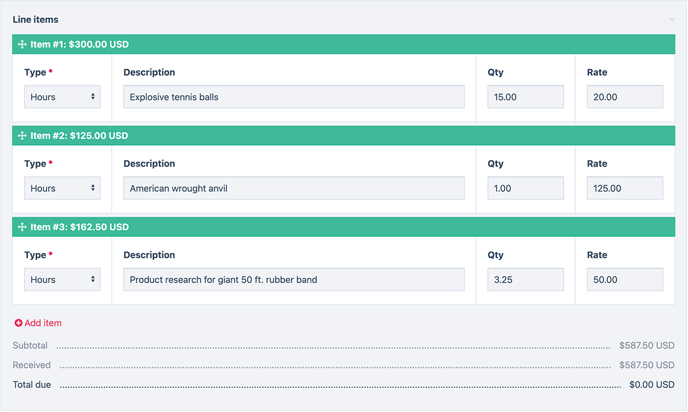

# ProcessWire Invoice Application Site Profile

A full invoicing application developed in ProcessWire. Enables you to create invoices, 
record payments to them, email invoices to clients, print invoices, and more.

This site profile is primarily used from ProcessWire’s admin, but it does
also come with front-end templates to list, view and print invoices.

## Installation

This site profile is installed in the same manner as any other site profile. 
Below is a summary: 

1. [Download](https://processwire.com/download/core/) a fresh copy of 
   the ProcessWire core (3.0.227 or newer is required) and extract the core 
   files into a new web accessible directory, i.e. `/invoices/`.

2. Download and copy the entire contents of *this* site profile into a 
   `site-invoices` directory under your core installation directory, for 
   example `/invoices/site-invoices/`. 

3. Open the installation directory in your web browser, for example 
   <http://localhost/invoices/>. This will start the installer. 

4. When the installer asks you what site profile you want to install, select 
   the “Invoice Application Site Profile”. Proceed with installation. After 
   installation, login to the admin as instructed by the installer.

5. In the admin, the first thing you should do is go and edit the "Settings" 
   page. This is where you can set your company name, logo, address, email 
   and more. 

## Getting started

Once installed, you'll notice this site profile comes with a few example 
invoices and clients already installed. These are here to give you a quick 
demonstration of how the invoices work. Feel free to make some test edits to 
the examples. 

If you intend to use the invoice application to create your own invoices, 
you'll want to delete the example invoices and clients when you no longer 
need then.

Use of the Invoices site requires that you are logged in. Though actual
invoices can be viewed directly by URL whether logged in or not. This enables
you to send the URL to a client if you want to. It also enables the
email-invoice function to work. If you want to change the logic behind the
access control, you can do so from the /site/templates/_init.php file.

Additional information is coming soon via a related blog post. This will 
include a detailed explanation of the included files, how you might use 
invoices, how you might send them to clients, how to customize and expand 
the invoices profile, and more. 